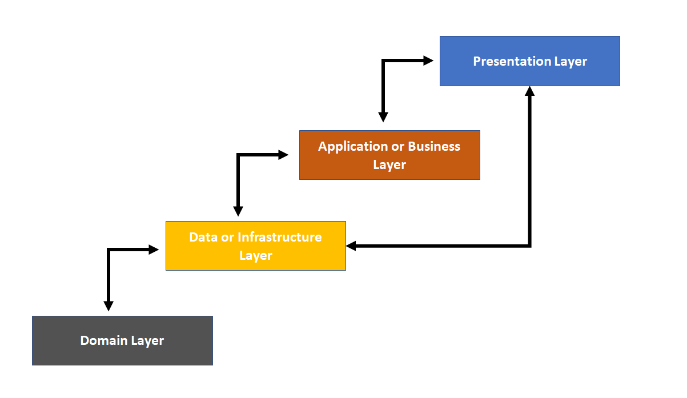

# .Net Core Web API 

> [!TIP]
[Demo Video Tutorial in Tamil](https://youtu.be/w8l0BCsuEyY?si=AEOJUvS3zF84TINo) |
[Full Video Tutorial in Tamil](https://www.udemy.com/course/ultimate-guide-to-net8-core-web-api-with-ef-core/)

## Course content

- **API CRUD Operations:** Learn to create, retrieve, update, and delete data using API endpoints, mastering the fundamental operations that drive application functionality.
- **Database Connectivity:** Understand the essential concepts of connecting your API to various databases, ensuring seamless data interaction.
- **Entity Framework Core:** Dive into the powerful ORM tool to simplify database operations and optimize data access.
- **Data Annotation:** Discover how to use data annotations for model validation, ensuring data integrity and reliability.
- **Dependency Injection:** Learn the art of injecting dependencies into your application.
- **Data Transfer Objects [DTO]:** Master the creation of DTOs to enhance data transmission efficiency and security.
- **Auto Mapper:** Streamline the process of mapping data between different layers, reducing complexity and boosting productivity.
- **Repository Pattern:** Grasp the concepts of the repository pattern for improved data access and separation of concerns.
- **Fluent Validation:** Learn how to implement robust validation logic using Fluent Validation, ensuring the accuracy and consistency of incoming data.
- **Exception Handling:** Discover strategies to handle exceptions gracefully, preventing disruptions and maintaining application stability.
- **Filters + Pagination:** Implement filters and pagination techniques to efficiently manage and retrieve data from your APIs.
- **Data Seeding:** Explore methods for initializing your database with sample data, aiding in testing and development.
- **.NET Identity:** Dive into the world of user management and authentication with .NET Identity, laying the foundation for secure application access.
- **Authentication & Authorization:** Understand the principles of authentication and authorization, controlling access to your APIs effectively.
- **Secure API with JWT Token:** Learn how to enhance API security using JSON Web Tokens (JWT) for secure data transmission.
- **Role-Based API Access:** Implement role-based access control, ensuring that different users have appropriate levels of access to your APIs.
- **Logging:** Explore effective logging techniques to capture valuable information for debugging and monitoring.
- **Response Caching:** Improve API performance with response caching, reducing redundant data requests.
- **API Versioning:** Understand the importance of versioning your APIs and how to implement it seamlessly.
- **Azure + IIS Server Deployment:** Get hands-on experience in deploying your API to Azure and IIS servers for public access.

| N-Tier Architecture |  Architecture Diagram |
| :-------------------: | :---: |
| Explore the benefits of structuring your application into distinct layers for improved scalability, maintainability, and code organization. |  |
